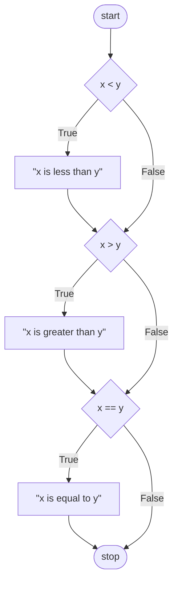
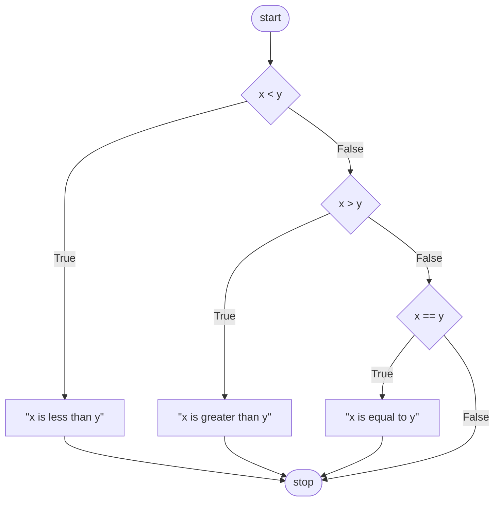
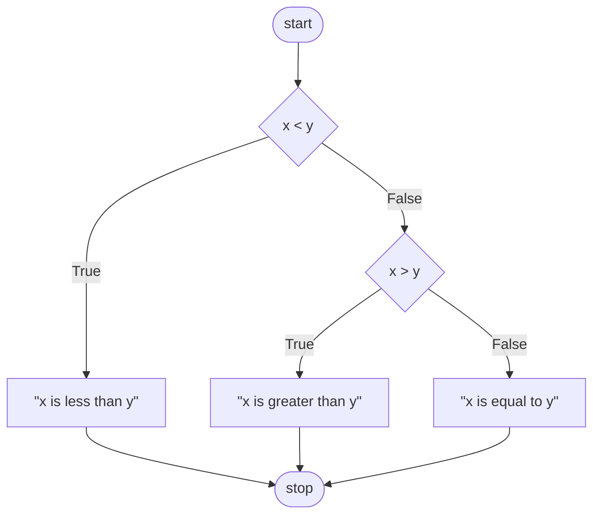
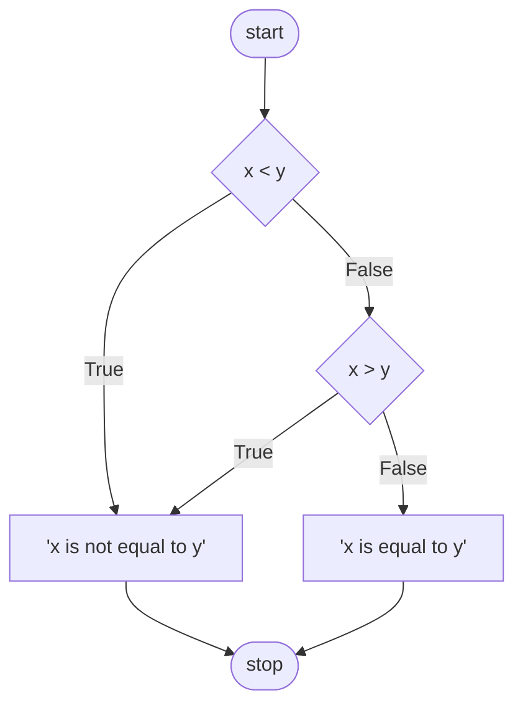
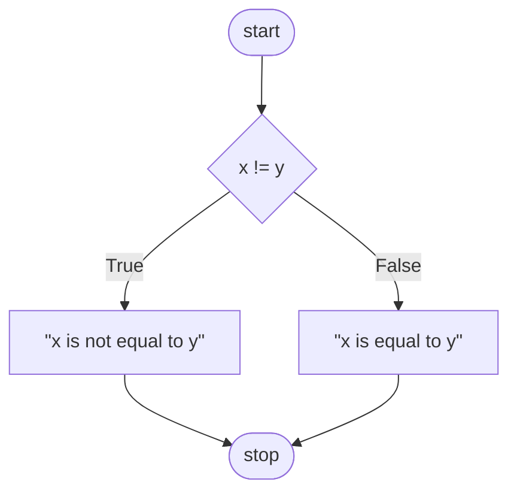
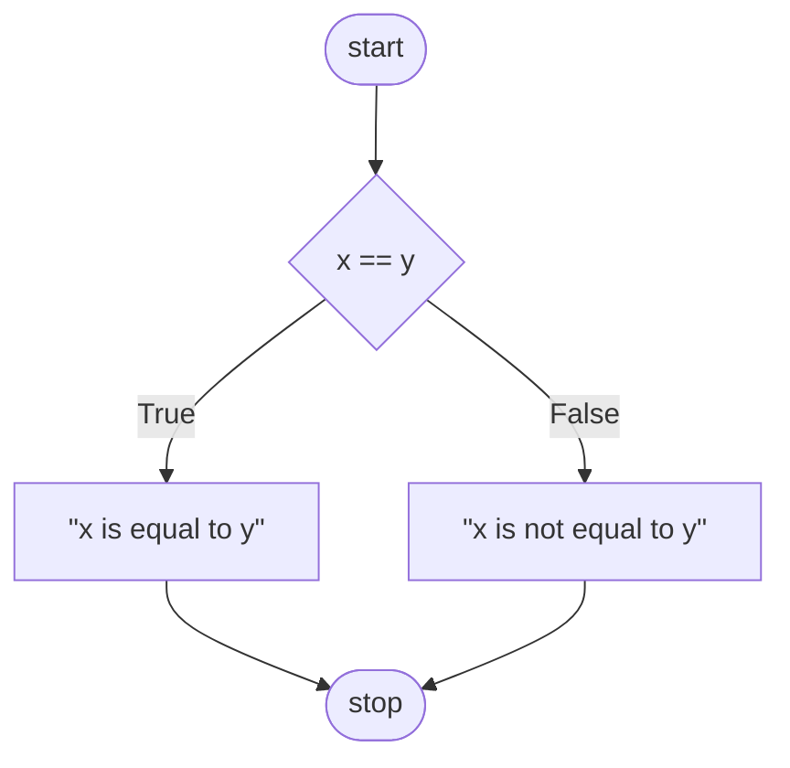

Python is a programming language, is also an interpreter that receives the input of file (.py) and translate its content (code) into 0 & 1 that computer can understand.

The Python has **_pre-defined functions_** like print(), input(), etc.
**_Side effects_** is an action performed by a function that has an observable result. It can be visual, audio, etc, that is something that appears/displays on the screen

```python
# What does the = (equal sign) do is copying the value (input) in Right of equal side to the Left variable (name).
name = input("What's your name? ")
print("hello, ")
print(name)
```

## comment

Use **_comment (# or """)_** to remind your intent and what the code is doing. Comment also can be served as the Pseudocode (To-Do-List) in human language before writing the code especially if have no idea to write the code.

```python
# Ask user for their name

# Say hello to user

"""
Is a comment
"""

```

## Concatenation

using + operator

```python
# Ask user for their name
name = input("What's your name? ")

# Say hello to user
print("hello, " + name)
print("hello,", name)
```

## Parameters

Parameters are what can be passed to a function, **_Arguments_** are the values/inputs that were passed to a function when actually using the function. Parameter & Argument are the same thing, but the terms were used from looking at the problem from different directions (What the function can take VS. What was actually passing into the function).

```python
# Default: print(*objects, sep=' ', end='\n', file=sys.stdout, flush=False)
# sep => separator
name = input("What's your name? ")

print("hello, ", end="???")
print(name)

print("hello, ", name, sep="???")
```

Positional paramater => The first thing passed to the print(), gets printed first, second gets printed second, and so on. Example: "hello," , name
Named parameter => Use them by name, they usually are optional. Example: end, sep

To print the quotes within the quotes. Backslash \ is an escape character that was expressed by multiple character. (Example: \n)

```python
print('hello, "friend"')
print("hello, \"friend\"")
```

## Method

Method is a function that's built in to a type of value. (Example: .strip(), .capitalize())

```python
# Ask user for their name
name = input("What's your name? ")

# Remove white space in str
name = name.strip()

# Remove white space from the right side in str
name = name.rstrip()

# Capitalize the first letter on first word
name = name.capitalize()

# Capitalize the first letter on all words
name = name.title()

# The methods are free to be chained as many as wanted
name = name.strip().title() # OR name = input("What's your name? ").strip().title()

# Split name into first name & last name by " " (space)
first, last = name.split(" ")

# Say hello to user
print(f"hello, {name}")
```

## Interactive mode

Python supports interactive mode. Type "python" command to open the interpreter, every time type a code inside the interpreter it will run immediately.

## int & float

**_int_** is not only a type of data, int() is also a function to convert string to actual number.
**_float_** is decimal number.
Calculator:

```python
x = int(input("What's x ?"))
y = int(input("What's y ?"))

# Default: round(number[, ndigits])
z = round(x + y)

print(z)
```

## f string

Format string to format numbers.

```python
z = 1000

print(f"{z:,}")
# 1,000
```

Integer can be infinite, but the floating point value is finite.

```python
x = float(input("What's x? "))
y = float(input("What's y? "))

# Default: round(number[, ndigits])
z_1 = round(x / y, 2)
print(z_1)

z_2 = round(x / y)
print(f"{z_2:.2f}")
```

## def

**_def_** is short for define, is used to define a function.

```python
def hello(to="world"):
    print("hello, ", to)

hello()
name = input("What's your name? ")
hello(name)
```

The functions must be defined first before being called.
**Scope** refers to a variable only existing in the context in which we defined it. In so far as we define the variable "name" in the main() function, we can only use that variable in the main() function, we cannot use it in the hello() functions or other function else.

```python
def main():
    name = input("What's your name? ")
    hello(name)

def hello(to="world"):
    print("hello, ", to)

main()
```

## return

**_return_** is to return back a value, to not have a side effect (directly appears on screen).

```python
def main():
    x = input("What's x? ")
    print("x squared is ", square(x))

def square(n):
    # return n * n
    return n ** 2
    # return pow(n, 2)
```

## Conditionals

Conditionals or conditional statements are the ability to ask questions and answer those questions in order to decide to execute which line of code.

### if

if the answer to this question is true, then go ahead and execute this code.



```python
x = input("What's x? ")
y = input("What's y? ")

if x < y:
	print("x is less than y")
if x > y:
	print("x is greater than y")
if x == y:
	print("x is equal to y")
```

#### elif

elif is short for else if, which allows us to ask a question that takes into account whether or not the previous question had a true or false answer.
We made this conditions mutually exclusive, which means do not keep answering questions once we get back a true answer.
For example below, once "if x < y" is true, print out "x is less than y", and we are done logically.



```python
x = input("What's x? ")
y = input("What's y? ")

if x < y:
	print("x is less than y")
elif x > y:
	print("x is greater than y")
elif x == y:
	print("x is equal to y")
```

Code:

```python
x = input("What's x? ")
y = input("What's y? ")

if x < y:
	print()
elif x > y:
	print()
else:
	print
```

Flowchart:



Code:

```python
x = input("What's x? ")
y = input("What's y? ")

if x < y or x > y:
	print()
else:
	print()
```

Flowchart:



Code:

```python
x = input("What's x? ")
y = input("What's y? ")

if x != y:
	print()
else:
	print()
```

Flowchart:



Code:

```python
x = input("What's x? ")
y = input("What's y? ")

if x == y:
	print()
else:
	print()
```

Flowchart:



## Loops

Print the "meow" three time, can be easily done:

```python
print("meow")
print("meow")
print("meow")
```

But let say if in an extreme case that wants to print the "meow" 100 times or 1000 times? Writing hundreds or thousands lines of duplicated code is very bad.

### while

**_while_** is one way to express what's called a loop. Loop is a block of code that does something again and again.

```python
"""
i = 3
while i != 0:
	print("meow")
	i = i - 1
"""

OR

i = 0  ## Start counting from 0 is a convention
while i < 3
	print("meow")
	i += 1  ## same as i = i + 1
```

### for

**_for_** is another way to express loop.
**_list_** is a data type of containing multiple values in the same variable.

```python
# for i in [0, 1, 2]:
for i in range(3):
	print("meow")
# range() returns a range of values that go up to, but not through the number that you specify. range(3) returns 0,1,2

for _ in range(3):
	print("meow")
# Use _ to name the variable that programming feature requires, but you the human do not use it in code.
```

In python, you can print something multiply it by the number of times, and you will get back exactly the result.

```python
print("meow" * 3)
print("meow\n" * 3)
print("meow\n" * 3, end="")
```

In python, when you want to get user input that matches a certain expectation (all positive, all negative, etc) , you can induce an **_infinite loop (while True)_**. Use **_infinite loop (while True)_** when you want do something again and again and again, but only until the user give you the value that you care about.
**continue** is used to continue to stay within this loop
**break** is used to break out of the most recently begun loop

```python
while True:
	n = int(input("What's n? "))
	if n < 0:
		continue
	else:
		break
```

In more succinct way:

```python
while True:
	n = int(input("What's n? "))
	if n > 0:
		break

for _ in range(n):
	print("meow")
```

Wrapping into functions:
**return** not just to break out of a block of code, but also returns a value

```python
def main():
	number = get_number()
	meow(number)

def get_number():
	while True:
		n = int(input("What's n? "))
		if n > 0:
			return n
			## return not to break out of a block of code, but also return a value

def meow(n):
	for _ in range(n):
		print("meow")

main()

OR

"""
def get_number():
	while True:
		n = int(input("What's n? "))
		if n > 0:
			break
	return n
"""

def meow(n):
	for _ in range(n):
		print("meow")

main()
```

### list

**_list_** is a set of multiple values.

```python
students = ["Hermione", "Harry", "Ron"]

print(students[0])  ## Zero Index: the 1st item in a list is at location 0
print(students[1])  ## Use [] to index into a list
print(students[2])

## Use for loop to iterate not just numbers, but strings
for student in students:
	print(student)
```

### len()

**_len()_** returns the length of a list and other things down to line.

```python
students = ["Hermione", "Harry", "Ron"]

for i in range(len(students)):
	print(i + 1, students[i])
```

### dict

**_dict_** is a data structure that associates one value with another (key with value). dict is 2-dimensional, like human dictionary it associates words with their definitions.
For example, associating a student name with a house as below:

| Hermione   | Harry      | Ron        | Draco     |
| ---------- | ---------- | ---------- | --------- |
| Gryffindor | Gryffindor | Gryffindor | Slytherin |

Code Implementation:

```python
students = {
	"Hermione": "Gryffindor",
	"Harry": "Gryffindor",
	"Ron": "Gryffindor",
	"Draco": "Slytherin",
}

print(students["Hermione"])  # output: "Gryffindor"
print(students["Harry"])  # output: "Gryffindor"
print(students["Ron"])  # output: "Gryffindor"
print(students["Draco"])  # output: "Slytherin"

# When using for loop in Python to iterate over a dictionary, by design it iterates over all of the keys.
for student in students:
	print(student)  # output: "Hermione" "Harry" "Ron" "Draco"


for student in students:
	print(student, students[student], sep=", ")
```

when using **for loop** in dict, Python automatically assigns the key to the variable (_student_) that defined behind the "for" (for _student_ in students) over cycles.

The previous example is just a single dictionary. When we want to associate multiple things, use a list of dict. Here a list of dictionaries that is four students, and suppose that each of these students is itself a dictionary. A collection of key value pairs.

```python
students = [
	{"name": "", "house": "", "patronus": ""},
	{"name": "", "house": "", "patronus": ""},
	{"name": "", "house": "", "patronus": ""},
	{"name": "", "house": "", "patronus": None},
	# None is a special keyword that represents officially the absence of a value.
	# " " is Not Clear to mean that it has NO Value.
	# None makes Clear that it has NO Value and it's not just oversight on my part.
]


```

Python function allows us to create abstraction. Abstraction is a simplification of a potentially more complicated idea.

```python
def main():
	print_column(3)

# Abstraction is a function that we defined first, but we do not work on it yet.
# def print_column(height):

```

```python
def main():
	print_row(4)

def print_row(width):

```

## Exceptions

Exceptions refer to problem in our code when something is exceptional in our program.

### try & except

**try** and **except** statements to catch a ValueError or other types of errors as well, though not SyntaxError.
try except

```python
try:
	x = int(input("What's x? "))
	print(f"x is {x}")
	# The best practice is should only be trying to very few lines of code that can actually fail in some way.
	# DO NOT include the code that is certainly will not raise the error, like print().
except ValueError:
	print("x is not an integer.")
```

There is a way in Python where we can say except if anything goes wrong and we can literally omit ValueError and just catch everything. The problem with that is sometimes it hides other bugs in the code, because we don't necessarily know what's going wrong and we cannot handle it correctly, so bad practice. A better practice is to figure out what kind of errors could happen and include mention them explicitly.

### else

**else** is the another feature of the try and except that Python supports.

```python
# try, except, else: You can try to do the following, except if this goes wrong, but if nothing goes wrong else go ahead and do this.
try:
	x = int(input("What's x? "))
except ValueError:
	print("x is not an integer.")
else:
	print(f"x is {x}")
# Python will try to execute line 2, if something goes wrong it will execute line 3 and 4 to handle the ValueError, however if you try and this code succeeds then there is no exception to handle, then it will excecute line 6.
```

It is more user friendly if we prompt or reprompt the user again and again, until the user gives us the correct response.

```python
while True:
	try:
		x = int(input("What's x? "))
	except:
		print("x is not an integer.")
	else:
		break

OR

while True:
	try:
		x = int(input("What's x? "))
		break
	except:
		print("x is not an integer.")


print(f"x is {x}")
```

Wrapping into functions:
Purpose of a function is not just to print something on screen like a side effect, but is to hand back a value (return a value).
The good properties of function is that we abstracted away the whole process of getting int from user into the get_int() function.

```python
def main():
	x = get_int()
	print(f"x is {x}")

def get_int():
	while True:
		try:
			x = int(input("What's x? "))
		except:
			print("x is not an integer.")
		else:
			break
	return x

main()
```

Tighten up the code to decrease the probability making mistake by having fewer lines.

```python
def main():
	x = get_int()
	print(f"x is {x}")

def get_int():
	while True:
		try:
			"""
			x = int(input("What's x? "))
			return x
			# Why define a variable x here if we immediately going to use it and then never again
			"""

			return int(input("What's x? "))
		except:
			print("x is not an integer.")

main()
```

### pass

**pass** is used to pass on doing anything with the exception.
Instead of printing out again and again "x is not an integer." , we could pass on handling the error further. We are still catching the error, but we are passing on saying anything about it like silently ignoring it, we are going to stay in the loop, and keep prompting, and reprompting the user. If we are handling error with pass, the caller, main or other callers do not know anything technically about the error.

```python
def main():
	x = get_int()
	print(f"x is {x}")

def get_int():
	while True:
		try:
			return int(input("What's x? "))
		except:
			pass

main()
```

The Pythonic way of doing things is often to try things, hope they work, but if they don't, handle the exception. Other languages are more in favor of checking "if, if, elseif, elseif, else", all of these conditionals, Python tends to be like, try it but just make sure handling the error.

Let say we do not hardcode, that is type manually "What's x?" all over the place. Instead, we pass in a parameter to the get_int() for more reusable.

### Caller & Callee

**Caller** is to call the function, means use it.
**Callee** is the function being called.
It would be better if the caller main() does not have to know what the callee get_int() is naming its variables and vice versa.

```python
def main():
	x = get_int("What's x? ")
	print(f"x is {x}")

def get_int(prompt):
	while True:
		try:
			return int(input(pronpt))
		except: ValueError:
			pass
```

raise to rase exceptions ourselves.

## Libraries

**Libraries** are generally files of code that other people have written that we can use in our own program, or the code that we have written that we can use it in our program.

### module

**module** is just a library that typically has one or more functions or other features built into it.

#### random

**random** is a module that was installed together with Python interpreter, it is used to do things randomly, like flipping coin, picking random number between 1 and 10, etc.
import allows us to import the contents of the functions from some module.

##### random.choice(seq)

The choice() function exists in the random module, and in parenthesis () there is a parameter called seq for sequence, and sequence generally means a list or something that is list like.

```python
import random

coin = random.choice(["heads", "tails"])
print(coin)
```

### from

**from** allows us to import the functions from a module more specific than import alone.

```python
from random import choice

coin = choice(["heads", "tails"])
print(coin)
```

The first approach, by just importing random makes sure that all of its contents are scoped to the random module. We can have our own choice functions and our own choice variable, which means we can use the same names as all of the functions or variables that are stored inside that file, without them colliding. In older languages, if we imported someone's library, we cannot use the same functions or variables as they are, because we might have some kind of conflict. Python allows us to scope the names of those functions and variables to the file or the module they come from.
from and import a specific function that we need could tighten up the code. If we are using choice() function in so many places, calling random.choice() n times is just making our code longer and longer.
Both approaches are correct, it depends, but sometimes it is better to do the first approach which is only import the module so as to retain the scope therein.

##### random.randint(a, b)

**random.randint(a, b)** gives back a random int that is between a and b _inclusive_.

```python
import random

number = random.randint(1, 10)
# Give back the number between 1 and 10 inclusive, including the 1 and the 10, each with 10% probability.
print(number)
```

##### random.shuffle(x)

**random.shuffle(x)** takes in a list for instance of values and just shuffles/randomizes them.
It shuffles the argument in place, means it does not return a value that contains the shuffled list. It actually shuffles the list it is given itself.

```python
import random

cards = ["Jack", "Queen", "King"]
random.shuffle(cards)

for card in cards:
	print(card)
```

#### statistics

**statistics** library contains all sorts of functions for doing things more statistical in nature, namely calculating means, medians, modes or other aspects of dataset.
statistics.mean() accepts a list of values.

```python
import statistics

print(statistics.mean([100, 90]))
```

### command-line arguments

**command-line arguments** is a feature not just of Python but of languages more generally that allows us to provide input (arguments) to the program when we are executing it at the command line.

#### sys

**sys** is short for system, sys module contains whole lot of functionality that is specific to the system itself and the commands we are typing.

##### sys.argv

**sys.argv** stands for argument vector, describes the list of all of the words that the human typed in at their command line before they hit enter. This variable is a list, means that the first element will be the first word that we typed, the second element will be the second word that we typed and so forth.
Run in terminal:
python name.py David
sys.argv\[0] == name.py , sys.argv\[1] == David

```python
import sys

print("hello, my name is", sys.argv[1])
# sys.argv[0] == name.py , sys.argv[1] == David
```

Handling the error if we don't type anything in:
python name.py

```python
import sys

try:
	print("hello, my name is", sys.argv[1])
except IndexError:
	print("Too few arguments")
```

More defensive alternative:
python name.py David Malan
python name.py "David Malan"

```python
import sys

if len(sys.argv) < 2:
	print("Too few arguments")
elif len(sys.argv) > 2:
	print("Too many arguments")
else:
	print("hello, my name is", sys.argv[1])
```

So strictly speaking, we don't have to handle exceptions if we can just check for the things that we are worried about, especially if we want to give the user more refined advice. We want to tell them clearly about the error, like that's too few, that's too many via conditionals.

It's better to keep all of the error handling separate from the actual code that we care about, instead of relegated the actual code to the else clause. Having all of these if, else if at the top of the code that are checking to make sure that all of the data is as expected, but not to hide the actual code in this else statement.
We need to add the exit prematurely if the program itself just cannot proceed, or else the program will blindly proceed until the end then only exit even though the error occurred earlier.

##### sys.exit()

**sys.exit()** exits the program with the system's help. It can take different types of inputs, but if we pass it a string, it will indeed print that string and exit.
python name.py David

```python
import sys

# Check for errors
if len(sys.argv) < 2:
	sys.exit("Too few arguments")
elif len(sys.argv) > 2:
	sys.exit("Too many arguments")

# Print name tags
print("hello, my name is", sys.argv[1])
```

### slices

**slices** take a slice/subset of a list, maybe from the beginning, the middle, or the end.
Use the square bracket \[ ] to specify \[the start : the end] of the list we want to retain.
sys.argv\[1:] means to start at element index 1, and go until the end by omitting the second number.
We can slice something from the end, by using negative number, it has the effect of counting in the other direction, from the end of the list.
sys.argv\[1:-1] means to start at element index 1, and stop at the last element, not including the last element.
python name.py David Carter Rongxin

```python
import sys

# Check for errors
if len(sys.argv) < 2:
	sys.exit("Too few arguments")

# Print name tags
for arg in sys.argv[1:]:
	print("hello, my name is", arg) # output: David, Carter, Rongxin
# sys.argv[1:] means to start at element index 1, and go until the end by omitting the second number.

for arg in sys.argv[1:-1]:
	print("hello, my name is", arg) # output: David, Carter
# sys.argv\[1:-1] means to start at element index 1, and stop at the last element, not including the last element.
```

### package

**package** is a third-party library, which is a module essentially that is implemented in a folder, that other people have implemented for us.
**PyPI** website, the python package index which lives at the url: [pypi.org](https://pypi.org/) , that allows to download and install packages.
Python has its own package manager called **pip**. pip is a program that generally comes with Python itself nowadays that allows us to install packages by just running a command.

**_cowsay_** is a package that allows us to have a cow say something on the screen.
Ascii art is a textual way using just keys on the keyboard to print pictures on the screen.

```python
import cowsay
import sys

if len(sys.argv) == 2:
	cowsay.cow("hello, " + sys.argv[1]) # cow() only acccepts 1 string

OR

if len(sys.argv) == 2:
	cowsay.trex("hello, " + sys.argv[1])
```

### API

APIs, application programming interface, it can refer to python files and funcitons but often APIs refer to third-party services that we can write code to talk to. API is a mechanism whereby we can access data on someone else's server and somehow integrate it into our own program.
Many APIs but not all live on the internet these day, we can write code that in effect pretends to be a browser connects to that third-party API on a server, and download some data that we can then incorporate into our program.

#### requests

**requests** library allows us to make web requests, internet requests using Python code, as pretending like a browser.

### JSON

JSON, Javascript Object Notation is used as a language agnostic format for exchanging data between computers. By language agnostic, we don't have to use javascript, we can use any other languages to read json. It is a completely text-based format which means that if we visit that url with our browser, a bunch of text that is formatted will be downloaded.
```python
import requests
import sys


if len(sys.argv) != 2:
	sys.exit()

response = requests.get("https://itunes.apple.com/search?entity=song&limit=1&term=" + sys.argv[1])
print(response.json())

"""
Apple is returning a json response, but the requests library is converting it to a Python Dict, which is wonderful coincidental, almost the same syntax.
"""
```

#### json
Python also comes with a special library called **json**, that allows us to manipulate json data. **json.dumps()** for dump string, which is used to pretty print and nicely format the json.
```python
import requests
import sys
import json

if len(sys.argv) != 2:
	sys.exit()

response = requests.get("https://itunes.apple.com/search?entity=song&limit=1&term=" + sys.argv[1])
print(json.dumps(response.json(), indent=2))
# json.dumps receive a name param of indent.
# indent=2 will indent everything at least 2 spaces
```

Iterate over the server's response (json object) and print out the track name:

```python
import requests
import sys
import json

if len(sys.argv) != 2:
	sys.exit()

response = requests.get("https://itunes.apple.com/search?entity=song&limit=50&term=" + sys.argv[1])

object = response.json()
"""
output:
{
  "resultCount": 1,
  "results": [
    {
      "wrapperType": "track",
      "kind": "song",
      "artistId": 115234,
      "collectionId": 1440868131,
      "trackId": 1440868258,
      "artistName": "Weezer",
      "collectionName": "Weezer (Green Album)",
      "trackName": "Island In the Sun",
      "collectionCensoredName": "Weezer (Green Album)",
      "trackCensoredName": "Island In the Sun",
      "artistViewUrl": "https://music.apple.com/us/artist/weezer/115234?uo=4",
      "collectionViewUrl": "https://music.apple.com/us/album/island-in-the-sun/1440868131?i=1440868258&uo=4",
      "trackViewUrl": "https://music.apple.com/us/album/island-in-the-sun/1440868131?i=1440868258&uo=4",
      "previewUrl": "https://audio-ssl.itunes.apple.com/itunes-assets/AudioPreview211/v4/52/a6/03/52a6032e-39c0-fd3e-555d-ce683f3d9d31/mzaf_7707796819108024384.plus.aac.p.m4a",
      "artworkUrl30": "https://is1-ssl.mzstatic.com/image/thumb/Music115/v4/fc/ef/19/fcef196c-3f81-e9da-f02a-b55d900e7d69/16UMGIM53162.rgb.jpg/30x30bb.jpg",
      "artworkUrl60": "https://is1-ssl.mzstatic.com/image/thumb/Music115/v4/fc/ef/19/fcef196c-3f81-e9da-f02a-b55d900e7d69/16UMGIM53162.rgb.jpg/60x60bb.jpg",
      "artworkUrl100": "https://is1-ssl.mzstatic.com/image/thumb/Music115/v4/fc/ef/19/fcef196c-3f81-e9da-f02a-b55d900e7d69/16UMGIM53162.rgb.jpg/100x100bb.jpg",
      "collectionPrice": 9.99,
      "trackPrice": 1.29,
      "releaseDate": "2002-05-14T12:00:00Z",
      "collectionExplicitness": "notExplicit",
      "trackExplicitness": "notExplicit",
      "discCount": 1,
      "discNumber": 1,
      "trackCount": 10,
      "trackNumber": 4,
      "trackTimeMillis": 200307,
      "country": "USA",
      "currency": "USD",
      "primaryGenreName": "Rock",
      "isStreamable": true
    }
  ]
}
"""

for result in object["results"]
	print(result["trackName"])
	# the key "results" here was decided by the json response from the third party server
	# the key "trackName" is one of the items inside the "results" list
```

We can make our own library in Python. If we are implementing the same kinds of functions again and again, or copying and pasting same code, because we have the same problem again, a good practice is to bundle up that code we keep using and make our own Python module or package.
Bundling up the code that we keep reusing and make our own Python module/package.
Run python sayings.py
Output:
hello, world
goodbye, world

> [!NOTE] sayings.py
>
> ```python
> def main():
> 	hello("world")
> 	goodbye("world")
>
> def hello(name):
> 	print(f"hello, {name}")
>
> def goodbye(name):
> 	print(f"goodbye, {name}")
>
> main()
> ```

Run python say.py David
Output:
hello, world
goodbye, world
hello, David

> [!NOTE] say.py
>
> ```python
> import sys
> from sayings import hello
>
> if len(sys.argv[1] == 2):
> 	hello(sys.argv[1])
> ```

If we are blindly calling main() at the bottom of sayings.py , that means whenever this file is loaded by Python, main() will be called. And that is True even if we are importing this file or just a function from this file, as in the say.py file. When we import "from sayings import hello" , this tells Python to go find that module sayings.py , read it from top to bottom, left to right, and then import specifically the hello() function. By the time Python has read the sayings.py file, the last line of code recall is call main() , main() gets called no matter what.

The correct way to use the main() function is that we could use a conditional:
`__name__` is a special variable whose value is automatically set by Python to be "\_\_main**" when we run a file from the command line, as running python sayings.py .
Now with this additional conditional in sayings.py , if we run python sayings.py , it still works as before, but if we import it into other files ("from sayings import hello") , the \_\_name** will be set to the name of the module technically, so even the Python will find sayings.py and read it from top to bottom, it will ignore the call to main() this time because it is wrapped in that conditional. In this case, if we are importing a file and not running it directly at the command line, main() will not get called.

> [!NOTE] sayings.py
>
> ```python
> def main():
> 	hello("world")
> 	goodbye("world")
>
> def hello(name):
> 	print(f"hello, {name}")
>
> def goodbye(name):
> 	print(f"goodbye, {name}")
>
> if __name__ == "__main__":
> 	main()
> ```
